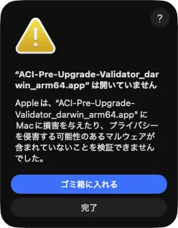
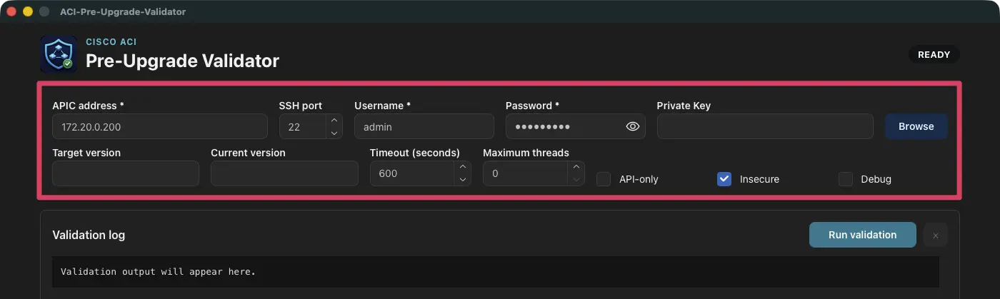
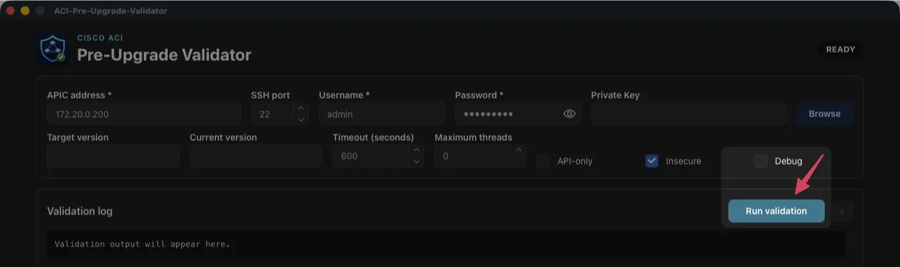
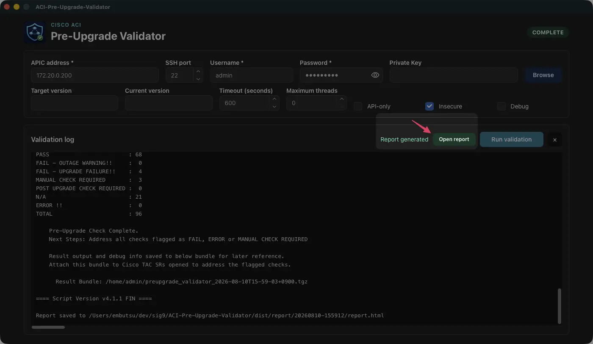
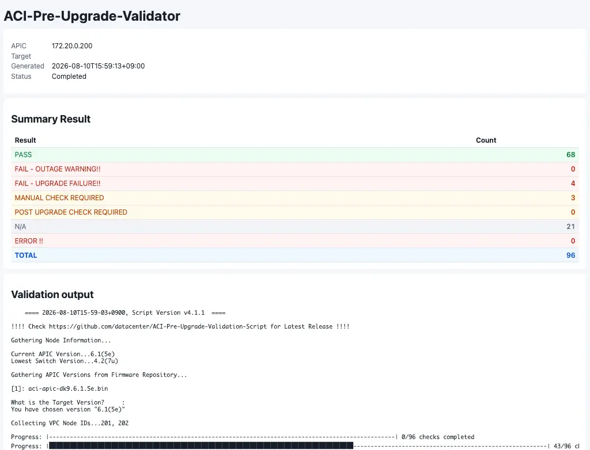

# ACI Pre-Upgrade Validator

English | [日本語](README_ja.md)

## Issues with “ACI-Pre-Upgrade-Validation-Script”

When upgrading [Cisco ACI](https://www.cisco.com/site/us/en/products/networking/cloud-networking/application-centric-infrastructure/index.html), you can run the following script beforehand and review the [validation checks](https://datacenter.github.io/ACI-Pre-Upgrade-Validation-Script/). Reviewing the detected items in advance helps eliminate concerns and risks associated with the upgrade. **However, the script must be copied to the APIC before it can be run, which makes the preparation somewhat cumbersome.**

- [ACI-Pre-Upgrade-Validation-Script](https://github.com/datacenter/ACI-Pre-Upgrade-Validation-Script)

## Features of “ACI Pre-Upgrade Validator”

“ACI Pre-Upgrade Validator” has the following features:

1. **No scripts or files need to be copied to the APIC. It can be run from a remote host.**
2. Prebuilt binaries are provided for both the CLI and GUI versions. No build process is required, so you can start using them immediately.
3. It runs as a standalone binary. No additional runtime or software installation is required.
4. The validation checks are exactly the same as those in [ACI-Pre-Upgrade-Validation-Script](https://github.com/datacenter/ACI-Pre-Upgrade-Validation-Script).
5. After execution, the bundle file (`.tgz`) generated on the APIC is downloaded automatically.
6. The validation results shown on screen are also saved as an HTML file.

## Requirements

The computer running this tool must be able to log in to the APIC via SSH. There are no other requirements.

## Installation

Binaries for the CLI and GUI versions can be downloaded from the [release page](https://github.com/pd-labs-admins/ACI-Pre-Upgrade-Validator/releases). Download the appropriate binary for your operating system and architecture, then save it in any directory.

### GUI tool

| OS | Architecture | File name |
| --- | --- | --- |
| macOS (darwin) | Intel (amd64 / x86_64) | `ACI-Pre-Upgrade-Validator_darwin_amd64.app` |
| macOS (darwin) | Apple Silicon (arm64 / AArch64) | `ACI-Pre-Upgrade-Validator_darwin_arm64.app` |
| Windows | 64-bit (amd64 / x86_64) | `ACI-Pre-Upgrade-Validator_windows_amd64.exe` |
| Windows | ARM 64-bit (arm64) | `ACI-Pre-Upgrade-Validator_windows_arm64.exe` |

### How to Handle Security Warnings on macOS

When you launch the macOS GUI binary, the following security warning may appear.



This is due to a macOS security mechanism that “prevents the launch of applications without a security signature.” To make the binary executable, please perform the following steps at your own risk. This will make the binary executable.

```sh
unzip ACI-Pre-Upgrade-Validator_darwin_arm64.zip
xattr -dr com.apple.quarantine ACI-Pre-Upgrade-Validator_darwin_arm64.app
```

### CLI tool

| OS | Architecture | File name |
| --- | --- | --- |
| macOS (darwin) | Intel (amd64 / x86_64) | `ACI-Pre-Upgrade-Validator-CLI_darwin_amd64` |
| macOS (darwin) | Apple Silicon (arm64 / AArch64) | `ACI-Pre-Upgrade-Validator-CLI_darwin_arm64` |
| Linux | 32-bit (386 / x86) | `ACI-Pre-Upgrade-Validator-CLI_linux_386` |
| Linux | 64-bit (amd64 / x86_64) | `ACI-Pre-Upgrade-Validator-CLI_linux_amd64` |
| Linux | ARM 64-bit (arm64) | `ACI-Pre-Upgrade-Validator-CLI_linux_arm64` |
| Windows | 32-bit (386 / x86) | `ACI-Pre-Upgrade-Validator-CLI_windows_386.exe` |
| Windows | 64-bit (amd64 / x86_64) | `ACI-Pre-Upgrade-Validator-CLI_windows_amd64.exe` |
| Windows | ARM 64-bit (arm64) | `ACI-Pre-Upgrade-Validator-CLI_windows_arm64.exe` |

## Configuration file

The tool can be run without a configuration file. However, creating one in advance lets you omit parameter input when running the tool. Save the configuration file with the name `config.ini` in the same directory as the CLI or GUI tool. An example configuration file is shown below.

```ini
APIC_ADDRESS="apic.example.com"
APIC_PORT="22"
APIC_USER="admin"
APIC_PASS="change-me!"
APIC_PRIV_KEY=""

TARGET_VERSION=""
CURRENT_VERSION=""
VALIDATION_TIMEOUT="600"
MAX_THREADS="0"
API_ONLY=""
SSH_INSECURE=""
```

The meaning of each setting is as follows.

| Setting | Required | Default | Example | Description |
| --- | --- | --- | --- | --- |
| `APIC_ADDRESS` | Required | - | `apic.example.com` | Host name or IP address of the APIC to connect to |
| `APIC_PORT` | - | `22` | `22` | SSH port for the APIC connection |
| `APIC_USER` | Required | - | `admin` | APIC username |
| `APIC_PASS` | Conditionally required | - | `change-me` | APIC password. Required when `APIC_PRIV_KEY` is not used |
| `APIC_PRIV_KEY` | Conditionally required | - | `/home/user/.ssh/id_rsa` | Path to the SSH private key file. Required when `APIC_PASS` is not used |
| `TARGET_VERSION` | - | - | `6.1(5e)` | ACI version to upgrade to |
| `CURRENT_VERSION` | - | - | `6.0(2h)` | Currently running ACI version |
| `VALIDATION_TIMEOUT` | - | `600` | `1200` | Validation timeout in seconds |
| `MAX_THREADS` | - | `0` | `10` | Maximum number of threads used for validation |
| `API_ONLY` | - | `false` | `true` | Run API checks only when set to `true` |
| `SSH_INSECURE` | - | `true` | `false` | When set to `false`, reject connections to APICs not registered in `known_hosts` |
| `DEBUG` | - | `false` | `true` | Display debug messages when set to `true` |

## Usage

This section explains how to run the tool.

### GUI tool

### Step 1

Double-click the binary for your environment from the operating system's GUI to start it. When the tool starts and the GUI is displayed, enter the required information, such as the destination APIC's IP address, username, and password.



### Step 2

After entering the required parameters, click the `Run validation` button to start the connection to the APIC. Wait for a while until processing is complete.



### Step 3

The validation results are displayed in the `Validation Log`. Click the `Open report` button to view the same content in HTML format.



### CLI tool

Run the tool by specifying the APIC address with `-a`, the username with `-u`, and the password with `-p`. If `config.ini` exists in the same directory as the tool, its parameters are read automatically, so you can omit them from the command line.

The following is an example output from the v4.2.0 script; result counts vary
with the APIC fabric and the selected target version.

```sh
% ./ACI-Pre-Upgrade-Validator-CLI_darwin_arm64 -a 172.20.0.200 -u admin -p 'change-me'
    ==== 2026-08-10T16-17-11+0900, Script Version v4.2.0  ====

!!!! Check https://github.com/datacenter/ACI-Pre-Upgrade-Validation-Script for Latest Release !!!!

Gathering Node Information...

Current APIC Version...6.1(5e)
Lowest Switch Version...4.2(7u)

Gathering APIC Versions from Firmware Repository...

[1]: aci-apic-dk9.6.1.5e.bin

What is the Target Version?     :
You have chosen version "6.1(5e)"

Collecting VPC Node IDs...201, 202

Progress: |████████████████████████████████████████████████████████████████████████████████████████████████████| 96/96 checks completed


=== Check Result (failed only) ===

[... snip ...]

=== Summary Result ===

PASS                        : 68
FAIL - OUTAGE WARNING!!     :  0
FAIL - UPGRADE FAILURE!!    :  4
MANUAL CHECK REQUIRED       :  3
POST UPGRADE CHECK REQUIRED :  0
N/A                         : 21
ERROR !!                    :  0
TOTAL                       : 96

    Pre-Upgrade Check Complete.
    Next Steps: Address all checks flagged as FAIL, ERROR or MANUAL CHECK REQUIRED

    Result output and debug info saved to below bundle for later reference.
    Attach this bundle to Cisco TAC SRs opened to address the flagged checks.

      Result Bundle: /home/admin/preupgrade_validator_2026-08-10T16-17-11+0900.tgz

==== Script Version v4.2.0 FIN ====
Report saved to /home/user/report/20260810-161719/report.html
```

The CLI tool also supports the following options.

```sh
% ./dist/ACI-Pre-Upgrade-Validator-CLI_darwin_arm64 -help
ACI-Pre-Upgrade-Validator-CLI dev

Usage: ACI-Pre-Upgrade-Validator-CLI [options]

Runs Cisco ACI pre-upgrade validation remotely over SSH and always writes an HTML report.

Based on Cisco Systems' ACI-Pre-Upgrade-Validation-Script:
https://github.com/datacenter/ACI-Pre-Upgrade-Validation-Script
Original copyright: Copyright (c) Cisco Systems, Inc. and/or its affiliates.
https://www.cisco.com/
Modified portions copyright: Copyright (c) PROGDENCE CO., LTD.
https://www.progdence.co.jp/

Options:
  -a, -address host    APIC address (config.ini: APIC_ADDRESS)
      -api-only        Run API checks only
      -current ver      Override current ACI version
      -debug           Print timestamped verbose output
  -h, -help            Show usage information
  -k, -insecure        Allow an APIC host not present in known_hosts
      -key file        SSH private key; takes priority over the password
      -max-threads n   Maximum validator threads
  -p, -pass value      APIC password
      -port number     SSH port (default: 22)
      -target ver      Target ACI version
      -timeout sec      Validator timeout (default: 600)
  -u, -user name       APIC username
      -update          Update this tool to the latest GitHub release
  -v, -version         Show version information

Example:
  ACI-Pre-Upgrade-Validator-CLI -address apic.example.com -target '6.2(1a)' -insecure
```

## HTML report file

When the tool exits successfully, it creates a `report` directory in the same directory as the tool and saves the validation report inside it.

```sh
├── ACI-Pre-Upgrade-Validator_darwin_arm64.app
├── ACI-Pre-Upgrade-Validator-CLI_darwin_arm64
├── config.ini
└── report
    └── 20260810-161719
        ├── preupgrade_validator_logs
        │   ├── json_results
        │   │   ├── access_untagged_check.json
        │   │   ├── aes_encryption_check.json

[... snip ...]

        │   │   ├── vpc_paired_switches_check.json
        │   │   └── vzany_vzany_service_epg_check.json
        │   ├── meta.json
        │   ├── preupgrade_validator_2026-08-10T16-17-11+0900.txt
        │   ├── preupgrade_validator_debug.log
        │   └── summary.json
        └── report.html
```

The HTML report displays a summary of the results (`Summary Result`) at the top. Review the summary and detailed contents, and take action as necessary.



## License and acknowledgements

This software is provided under the **Apache License 2.0**. See the accompanying [LICENSE](/LICENSE) file for details.

This tool is a derivative tool based on, and enhanced from, [ACI-Pre-Upgrade-Validation-Script](https://github.com/datacenter/ACI-Pre-Upgrade-Validation-Script) (Apache License 2.0), developed and published by [Cisco Systems, Inc.](https://www.cisco.com/). We sincerely thank the original developers and community for publishing and maintaining this excellent base tool as open source.

* **Original code copyright:** Copyright (c) [Cisco Systems, Inc.](https://www.cisco.com/) and/or its affiliates.
* **Modified portions copyright:** Copyright (c) [PROGDENCE CO., LTD.](https://www.progdence.co.jp/)
